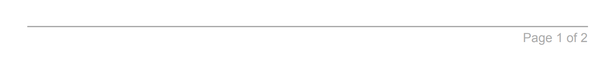

# HTML/CSS Templates

You can create a new template using HTML and CSS.

## SASS

For styling, DocSpring uses a CSS extension called [SASS](http://sass-lang.com/). SASS comes in two flavors, but we use the one that is compatible with standard CSS (SCSS).

You're able to paste in any CSS, and it will Just Work&trade;. SCSS also supports some powerful features, such as variables and nested rules. Take a look at the [SASS Guide](http://sass-lang.com/guide#topic-2) to learn more.

## Liquid

HTML templates use the [Liquid markup language](https://shopify.github.io/liquid/basics/introduction/) to insert your submission data (the field values) into the HTML. You can also add advanced logic, such as [conditions](https://shopify.github.io/liquid/tags/control-flow/) and [loops](https://shopify.github.io/liquid/tags/iteration/).

[Learn more about Liquid](https://shopify.github.io/liquid/basics/introduction/).

### Referencing Fields

Use the `{{ }}` syntax to insert a field value in your template.

For example, if you have a field with the name `book_title`, you can render that value in your template with the `{{ }}` syntax:

```html
<h2>{{ book_title }}</h2>
```

Use dot syntax to access nested fields, and square brackets for arrays:

```html
<h2>{{ song.title }}</h2>
<h2>{{ musicians[2] }}</h2>
```

### Liquid Filters

In the PDF template editor you may have seen date formatting, formulas for numbers, "uppercase" for text fields, etc. These features have been removed from our HTML template editor, because they can be achieved by using Liquid "filters".

For example, you can use the `upcase` filter to convert text to uppercase:

```html
<h2>{{ book_name | upcase }}</h2>
```

[See the Liquid Filters page for more information about available filters.](./liquid-filters)

Please [contact us](mailto:support@docspring.com) if you would like us to add a new Liquid filter.

> Note: DocSpring supports most of the Liquid filters that you can find in [the Liquid documentation](https://shopify.github.io/liquid/). However, you may find some third-party articles and documentation that reference filters that we don't support. For example, [Shopify](https://shopify.dev/docs/themes/liquid/reference) provides some custom liquid filters that are specific to Shopify stores.

### Signatures

You must use the `` Liquid tag to render signatures in your HTML template. Signatures can be either provided as an image, or as text (e.g. the user typed their name and selected a font). The `signature` tag will handle both of these cases:

```html

```

Image signatures will be rendered in an `` HTML element with a `signature-image` class:

```html

```

Text signatures will import the required font, and render the `name` inside a `<span>` HTML element with a `signature-text` class:

```html
<link
  href="https://fonts.googleapis.com/css?family=Dancing+Script"
  rel="stylesheet"
/>
...
<span
  class="signature-text"
  style="color: black; font-size: 16px; font-weight: normal; display: inline-block; font-family: 'Dancing Script';"
>
  John Smith
</span>
```

You can pass the following options to the `signature` tag in order to control the width and height of image signatures, or to change the font size and weight of text signatures. (These options are added as inline CSS styles.)

| Option        | Signature Type | Default Value  |
| ------------- | -------------- | -------------- |
| `width`       | Image          | `(from image)` |
| `height`      | Image          | `(from image)` |
| `font-size`   | Text           | `normal`       |
| `font-weight` | Text           | `16px`         |
| `color`       | Text           | `black`        |

There is also a `preview_type` option, which allows you to control the type of signature shown in preview PDFs. We display a image signature by default, but you can use `preview_type: text` to show a text signature.

Examples:

```html

```

```html

```

### Images

You can upload static images under the "Images" tab in the template editor. Use the `template_image_url` tag to get the image URL:

```html

```

To include an image or signature field (i.e. submitted in the API request body), you can use the field name as the `src` attribute for an `img` tag. This will refer to an internal URL for the image:

```html

```

If the image field is optional, you should use a condition, in case the image was not provided:

```html
  
```

### Dates

You can use the `date` filter to format a date field in your desired setting:

```html
<h2>{{ date | date: "%B %-d, %Y" }}</h2>
```

You can use the special `"now"` string to get the current date and time:

```html
<h2>{{ "now" | date: "%B %-d, %Y" }}</h2>
```

We also support an `in_time_zone` filter that allows you to convert dates and times between different timezones:

```html
<h2>{{ "now" | in_time_zone: "America/New_York" | date: "%B %-d, %Y" }}</h2>
```

Here is a [list](./liquid-timezones) of all timezones that you can use with the `in_time_zone` filter.

## Page Breaks

You can force content to start on a new page by adding the `page-break-before` CSS property to the chosen element.

> CSS:

```css
.new-page {
  page-break-before: always;
}
```

> HTML:

```html
<p class="new-page">This paragraph will start on a new page.</p>
```

[View documentation for the page-break-before, page-break-after, and page-break-inside properties](https://developer.mozilla.org/en-US/docs/Web/CSS/page-break-before).

## Headers and Footers

You can automatically add a header or footer to each page in the "Header HTML" and "Footer HTML" tabs. CSS from the _SCSS_ tab also applies to headers and footers.

The `pageNumber` and `totalPages` classes can be used to show the current page number and total pages. The following example shows how to add a footer with page numbers (e.g. _Page 1 of 2_):

```html
<footer
  id="footer"
  style="display: block; margin: 0 40px; padding-top: 3px; width: calc(100% - 80px); border-top: 1px solid #aaa; color: #aaa; text-align: right;"
>
  <div>
    Page&nbsp;<span class="pageNumber"></span>&nbsp;of&nbsp;<span
      class="totalPages"
    ></span>
  </div>
</footer>
```

Here's how the footer will display at the bottom of the PDF:



Our HTML engine automatically adds a 1 inch margin to the entire page. This makes it easy for customers to create templates knowing that they will print and display well. In the future we want to add functionality to edit this margin, but for now if you need the margin removed, get in touch with the support team who will happily sort it manually.

## Generating PDFs

Once you've set up your template and added fields, you can generate a PDF submission by filling out the [web form](../web-forms/), or [making an API request](../../api/generate-a-pdf).

A concierge service is available wherein you can hire DocSpring staff at an hourly rate to convert your static PDF templates into HTML / CSS templates.
