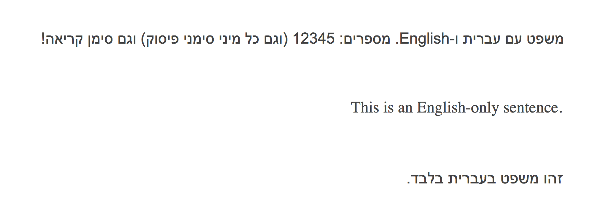

# Right-to-left Languages

DocSpring has some basic support for right-to-left languages, including Arabic and Hebrew.

When our system detects Hebrew or Arabic text, we will automatically set the PDF to render right-to-left. We will also set the font to _Arial_ for any fields that contain Hebrew or Arabic text. Please contact <a href="mailto:support@docspring.com">support@docspring.com</a> if you need to use a different font.

> Note: We are planning to add support for custom fonts in the future.

When setting up a PDF template that uses a right-to-left language, you will probably want to change the default text field alignment from `left` to `right`. You can change this by visiting your Template Settings, then scroll down to the "Text Defaults" section. This default text alignment setting can be overridden for each field, so your template can also include some fields that use a left-to-right language.

Here is an example PDF that includes both Hebrew and English text:

