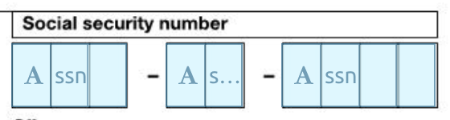
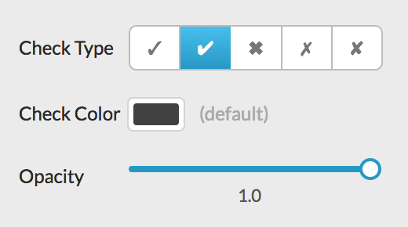
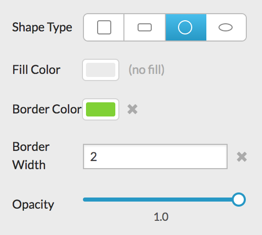
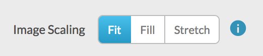
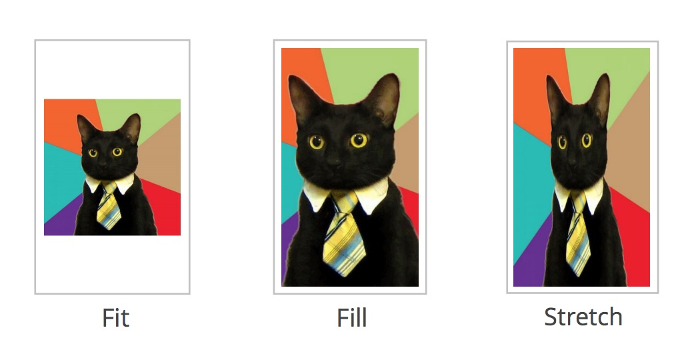
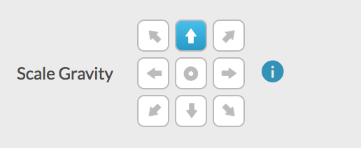
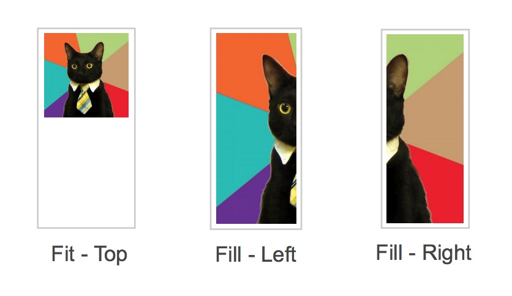
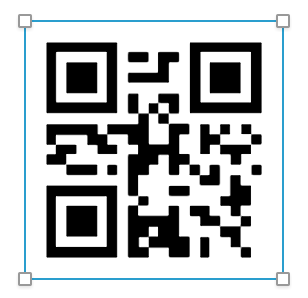
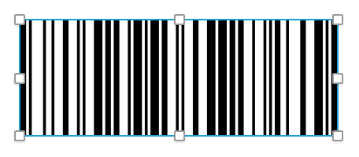

# Field Display Types

"Display Types" determine how data is displayed on the PDF.

## Text

### Typeface (Font)

When you choose a "monospace" typeface, we will automatically calculate the maximum number
of characters that can fit in the field. This will be added to the API schema as a validation.

### Multiline

When "Multiline" is checked, the text will wrap across multiple lines.
When unchecked, the text will be displayed as a single line.

### Comb

When checked, the field is divided into equally spaced boxes, or "combs", and one character is placed in each comb. You can configure the number of comb cells.

<!--  -->

DocSpring will display the lines that divide each cell:

DocSpring will display the lines that divide each cell, and these lines can be useful when you're not sure how many cells are in a field. For larger comb fields, continue incrementing the "Comb Cells" value until all of the lines match up.

> View the [SSN Fields](./ssn-fields) tutorial to see how you can use the "Comb Offset" option to format an SSN into three separate sections.

### Other Text Options

- Font Size
- Bold
- Uppercase
- Color
- Opacity
- Horizontal Alignment: _(Left, Center, Right)_
- Vertical Alignment: _(Bottom, Center, Top)_

## Check

You can configure the check character, color, and opacity.

## Shape

You can configure a fill, border, or both. You can also configure the border width, and opacity.

## Image

### Image Scaling

Images can be scaled to fit, scaled to fill, or stretched to fill the field dimensions.

### Scale Gravity

When you choose "scale to fit" or "scale to fill", you can configure the "gravity".
This lets you control the image position (for "fit"), or which part of the image is cropped (for "fill").

See the [Image Data Type](./field-data-types.md#image) section for information about images.

## QR Code

[_Strings_](./field-data-types.md#strings),
[_Emails_](./field-data-types.md#emails), and
[_URLs_](./field-data-types.md#urls)
can be displayed as QR Codes.

## Barcode

The following field data types can be displayed as barcodes:
[_Barcode_](./field-data-types.md#barcode),
[_String_](./field-data-types.md#string),
[_Email_](./field-data-types.md#email), and
[_URL_](./field-data-types.md#url).

> Note that the _Barcode_ data type can also be displayed as plain text.

_Strings_, _Emails_, and _URLs_ use the `Code 128` symbology, which supports any ASCII character.

