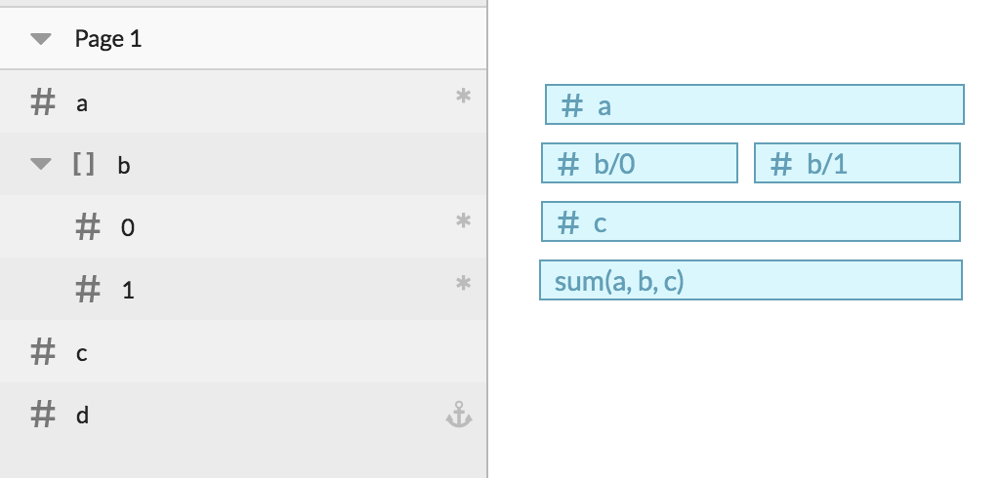
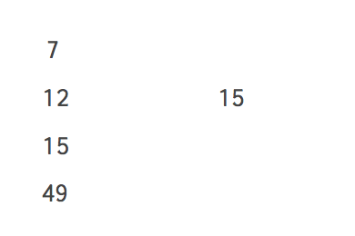

# Formulas

A [_Number_](./field-data-types.md#number) field can be a formula that performs a calculation. Formulas can reference other _Number_ fields. Formulas are configured in the _default_ or _static_ value for a _Number_ field.

> Note: You can configure formulas in your template, but your API request can only contain numbers.

## Operators and Functions

- Operators: `+`, `-`, `*`, `/`, `%`, `^`, `|`, `&`
- Functions: `MIN`, `MAX`, `SUM`, `ROUND`, `ROUNDDOWN`, `ROUNDUP`
- We support all functions from [Ruby's Math module](https://ruby-doc.org/core-2.4.2/Math.html), including `SIN`, `COS`, `TAN`, etc.

## Field References

Formulas use the following syntax for referencing field names:

- Object keys are separated by a period (`foo.bar`)
- Array indices are wrapped with square brackets (`foo[0]`)

The following table shows how to convert between the [JSON Pointer syntax](./field-names), and formula references:

| JSON Pointer | Formula Field Name |
| ------------ | ------------------ |
| foo/bar      | foo.bar            |
| foo/0/bar    | foo[0].bar         |
| foo/bar/0    | foo.bar[0]         |

> (We need to use a different syntax because `/` is the division operator in formulas.)

## Intermediate Variables

You may want to split up a calculation into multiple steps, or re-use the result of one calculation in multiple places. You can do this by creating a _Number_ field that is both _Static_ and _Hidden_.

This field will function as an intermediate "variable" that can be referenced by other formulas, but it will not be part of the API schema, nor is it displayed on the PDF.

## Example

Here's an example template that demonstrates a number of different features.

| Field Name | Required? | Static? | Default or Static value |
| ---------- | --------- | ------- | ----------------------- |
| `a`        | Yes       | No      | -                       |
| `b/0`      | Yes       | No      | -                       |
| `b/1`      | Yes       | No      | -                       |
| `c`        | No        | No      | `max(b)`                |
| `d`        | No        | Yes     | `sum(a, b, c)`          |

#### Notes:

- `a` and `b` are both required fields.
- `b` must be an array that contains two numbers.
- If `c` is not provided, the default formula will calculate the maximum value from the `b` array.
- `d` is a static field, and can only be computed from the other fields. `d` is not part of the API.

Given the following values:

- `a => 7`
- `b => [12, 15]`
- `c => null`

The generated PDF will show the following results:

