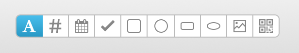

# Getting Started

## Add a Field

Add a new field by clicking and dragging on the template.

You can change the type of new fields by clicking one of the options in the header:

You can also change the type of new fields by using a [keyboard shortcut](./keyboard-shortcuts).

## Delete a Field

To delete a field, you can press `Backspace` or `Delete` while the field is selected.

You can also hover over the field in the sidebar, and click the Trash icon.
