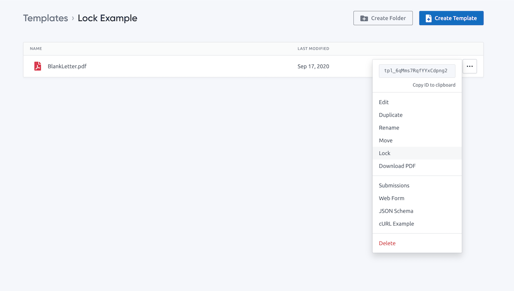
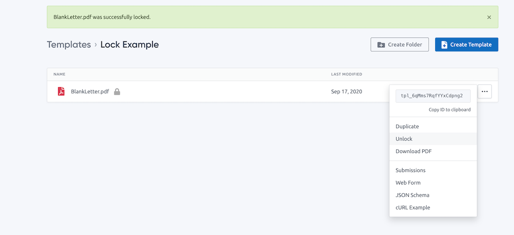
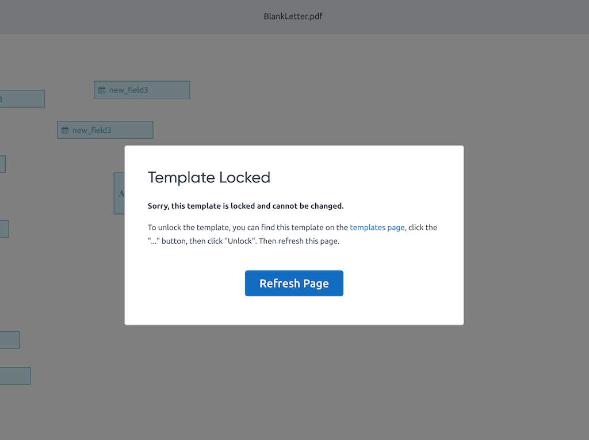

# Locked Templates

You can lock a template to prevent any updates. A locked template cannot be changed through the template editor or via any API endpoints.
However, you can still use a locked template to generate PDFs.

We are planning to add support for template versions in the future. In the meantime, you can use template locks and duplication to create a versioning workflow:

- Lock your template before you start using it in production.
- If you need to make any changes to the template, click "Duplicate" to create a copy of the template.
- Add a version number to to your template name, e.g. "Template v2".
- Make all of the necessary changes.
- Generate some test PDFs from your dev or staging environment.
- Lock the new template.
- Update the template ID in your code or configuration files to start using the new template.

You could also create a folder for each template to hold all of the different versions.

The "Lock" and "Unlock" options can be found [in the "..." menu on the Templates page](https://app.docspring.com/templates).

## Lock Template Option

## Unlock Template Option

## Locked Template Error

If you try to open the template editor for a locked template, you will see this error message:

