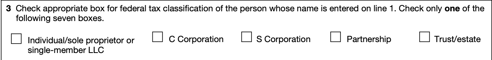
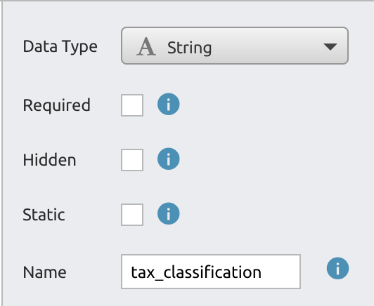
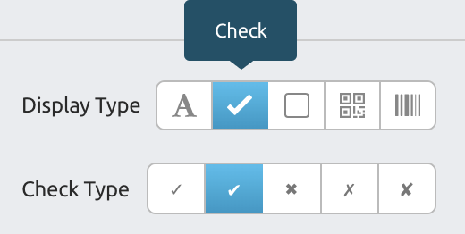
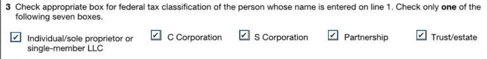
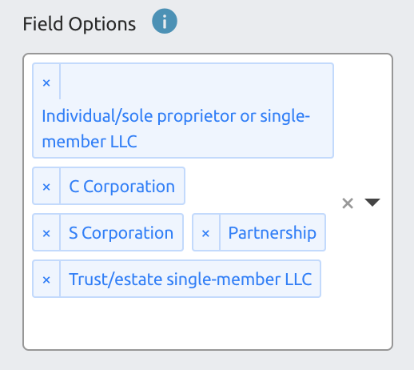
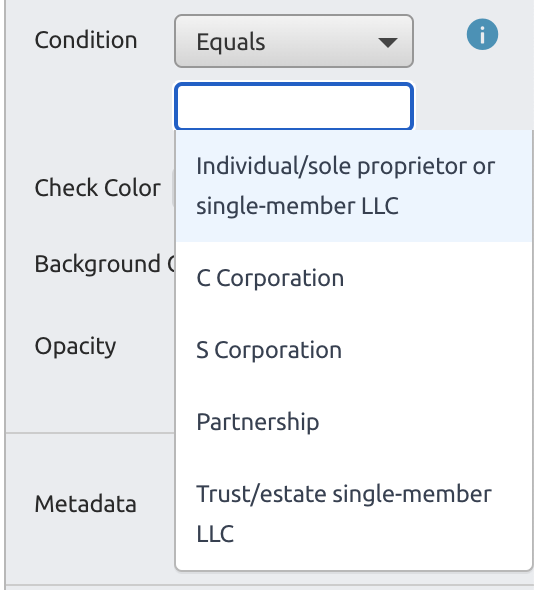
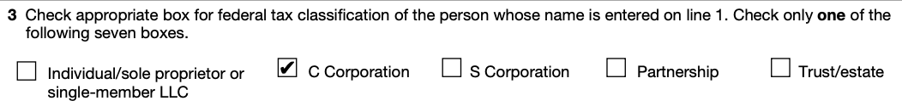
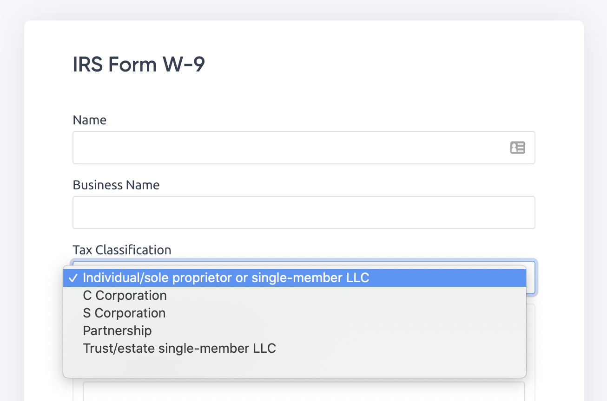

# Radio Buttons

Many forms have a list of checkboxes where only one checkbox should be checked. You can use DocSpring's powerful formatting logic to set up a radio button group. You can do this by setting up multiple String fields with the same name that are displayed as checkboxes, and by setting up an "Equals" condition so that checkboxes are displayed based on the field value.

The key thing to remember is that DocSpring fields have both a "Data" type and a "Display" type. Text (string) fields can be displayed as checkboxes or shapes, and boolean fields can be displayed as text. This flexibility allows you to set up very powerful logic in your PDF templates and web forms.

## Example: IRS Form W-9

Question 3 on the IRS W-9 form contains a group of checkboxes where you must only check one of the checkboxes.



To set up these checkboxes as a radio button group in DocSpring, create fields for each of the checkboxes. Give each field the same name (e.g. `tax_classification`.) Set the "Data Type" for these fields to `String`.



Instead of displaying these String fields as text, set the "Display Type" to "Check":



Now the template editor should show that each field will be rendered as a check:



Enter all of the "Field Options" (you will only need to do this once):



> If you will only be filling out PDFs with an API integration, then you could use shorter names for convenience. However, if you will be using our [automatically generated web forms](../web-forms), then you should use full human-readable names so that the form options are easier to understand.

Now scroll to the bottom of the options sidebar, set Conditions to "Equal", and choose the correct option for each checkbox field. (These will be automatically filled in from the Field Options you just entered.)



For example, set "Individual/sole proprietor..." as the condition for the first checkbox, "C Corporation" for the next checkbox, and so on.

That's it! Now you can send one of these `tax_classification` values in your API request, and only the corresponding checkbox will be checked. For example:

```
{
  "data": {
    "tax_classification": "C Corporation"
  }
}
```

Only one of the fields has an "Equals" condition that matches the "C Corporation" value, so this is the only field that is checked on the generated PDF:



All of the Field Option you added will be shown as a drop-down list on the [web forms](../web-forms):


