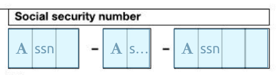
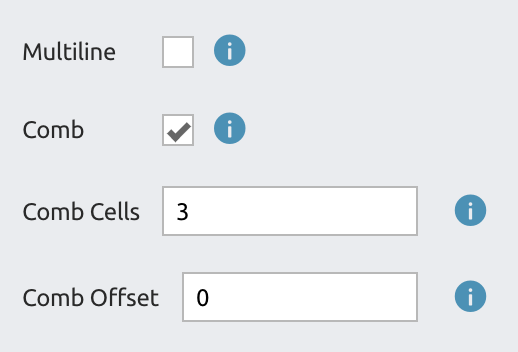

# SSN Fields

Some government forms have an SSN (social security number) "comb" field that is split into three sections:

To fill out this SSN field, you can use DocSpring's "Comb" and "Comb Offset" feature.

First, create a new field for each SSN section. Give all of these fields the same name (e.g. `ssn`.)

Now scroll to the bottom of the options sidebar, and check the "Comb" checkbox for each of these `ssn` fields.

Set the following options for the three fields:

- Cells: **3**, Offset: **0**
- Cells: **2**, Offset: **3**
- Cells: **4**, Offset: **5**

Now you can send a 9 character SSN as a single value in your data (e.g. `{ "data": { "ssn": "123456789" } }`), and this value will be split into `123` - `45` - `6789`. The SSN will be formatted correctly across the three SSN sections on the form.

