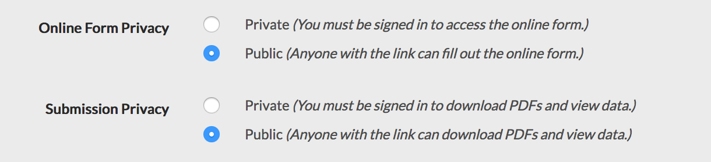
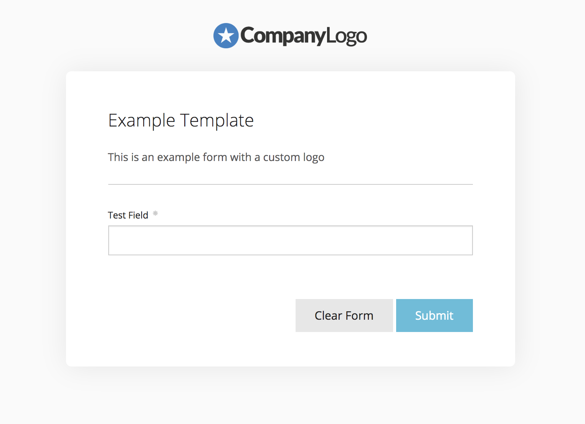

# Web Forms

We can automatically generate web-based forms based on your template schemas. If you send your users a link to this form, they can fill it out to generate a PDF, without you needing to design any UI wrapper. You can then redirect users to a different page after they have filled out the form.

You can also [embed](./embedded-forms) our web forms on your own website. Our embedded form JavaScript library can be configured with JavaScript options and callbacks.

## Configure Template Privacy Settings

First, make sure that "Online Form Privacy" is set to "Public" in your template's settings. This will allow unauthenticated users to fill out the embedded form.

You may also want to set "Submission Privacy" to "Public". When this is set to "Private", the user can save the form, but will not be able to see when the PDF has been processed. Nor will they be able to download the generated PDF.

When "Submission Privacy" is set to "Public", the user can wait until the PDF has been processed, and you can show them a link to download the PDF.



## Query Params

You can set some query params in the URL to provide default data or submission metadata, or to hide some fields on the form.

### Set Default Data

- `?data[field]=<value>`
- `?data[nested][field]=<value>`
- `?data[array][][field]=<value>`

Use the following syntax to set default data for nested fields inside objects or arrays:

| Field Name                          | Query Param                                          |
| ----------------------------------- | ---------------------------------------------------- |
| `name`                              | `data[name]=John`                                    |
| `person/name`                       | `data[person][name]=John`                            |
| `person/0/name`                     | `data[person][][name]=John`                          |
| `person/0/name` and `person/1/name` | `data[person][][name]=John&data[person][][name]=Bob` |

**Example:** See below foe how to set default values for the `name` and `email` fields.

```
https://app.docspring.com/templates/tpl_123/form?data[name]=John%20Smith&data[email]=test@example.com
```

### Set Submission Metadata

> Submission metadata is included in API responses and webhook notifications, but is not included in the generated PDF as the metadata is not inserted anywhere as a field value.

`?metadata[<key>]=<value>`

**Example:** Set an internal `userId` value in the submission metadata:

```
https://app.docspring.com/templates/tpl_123/form?metadata[userId]=123
```

**Example:** Change the PDF filename by setting `pdf_filename` in the submission metadata:

```
https://app.docspring.com/templates/tpl_123/form?metadata[pdf_filename]=MyGeneratedPDF_123
```

> When the user downloads the PDF, the filename will be MyGeneratedPDF_123.pdf

### Hidden Fields

You can also hide certain fields on the form by passing `hidden_fields` as a list of comma-separated field names.

`?hidden_fields=<field_1>,<field_2>,...`

**Example:** Set a default value for the `name` field, and hide the field:

```
https://app.docspring.com/templates/tpl_123/form?data[name]=John%20Smith&hidden_fields=name
```

**Example:** Set a default value for the `person/0/name` field, and hide the field.

_(You don't need to use any special syntax for nested fields in `hidden_fields`. You can refer to the original field name, as shown in the template editor.)_

```
https://app.docspring.com/templates/tpl_123/form?data[person][][name]=John%20Smith&hidden_fields=person/0/name
```

> NOTE: If you hide a required field without passing a default value, you will get a validation error and you will not be able to generate a PDF.

## Redirect to a URL

After the user submits the form, you can redirect them to a different URL. This can be configured in the [template settings](../../template-editor/settings).

The submission ID, template ID, and template name will be appended to this URL as query params: `https://example.com/?submission_id=sub_123&template_id=tpl_123&template_name=My%20Template`

When "Submission Privacy" is set to **"Private"**, the user will be redirected as soon as the form has been saved. When "Submission Privacy" is set to **"Public"**, the user will be redirected after the PDF has finished processing.

## Custom Logo

You can display a custom logo at the top of hosted web forms to 'whitelabel' the form.

Visit your [Account page](https://app.docspring.com/account), click the "Choose File" button under "Logo for Web Forms", then select an image file. You can upload an SVG, JPG, PNG, or WEBP image with a width of at least 400px. The max file size is 5 MB. For best results, your image should be a horizontal rectangle:


Click "Save" to upload your image. When you visit a template form, you should now see your logo at the top of the page:



> Note: Logos are not shown for embedded forms on your own website. However, since you have full control of your page page, you could manually add a logo or any other content above the embedded form.
